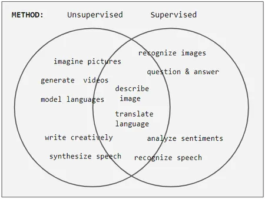

# Machine Learning

- Understanding and building methods that learn that is methods that
  leverage data to improve performance on some set of tasks.
- It is seen as a part of artificial intelligence.
- ML algorithms build a model based on sample data (training data) in order
  to make predictions or decisions without being explicitly programmed to do so.

- A subset of ML is closely related to computational statistics
    - focuses on making predictions using computers
    - but not all ML is statistical learning

- The study of mathematical optimization delivers methods, theory and application
  domain to the field of machine learning.

- Data mining is a related field of study, focusing on **exploratory data analysis**
  through unsupervised learning. (like we may use clustering to find pattern in the data)

- Some implementations of ML use data and neural networks in a way that mimics the working of biological brain.
- In its application across business problems, ML is also referred to as **predictive analysis**.

## Outline

- Classification
    - [Supervised learning](./supervised-learning/README.md)
        - Decision tree
        - Ensembles
            - Bagging
            - Boosting
            - Random forest
        - k-NN
        - Linear Regression
        - Naive Bayes
        - Artificial Neural Networks
        - Logistic regression
        - Preceptron
        - Relevance vector machine (RVM)
        - Support vector machine (SVM)
    - Semi-supervised learning
    - [Unsupervised learning](./unsupervised-learning/README.md)
        - Clustering
            - BIRCH
            - CURE
            - Hierarchial
            - k-means
            - Fuzzy
            - Expectation-maximization (EM)
            - DBSCAN
            - OPTICS
            - Mean shift
        - Dimensionality reduction
            - Factor analysis
            - CCA
            - ICA
            - LDA
            - NMF
            - PCA
            - PGD
            - t-SNE
    - Reinforcement learning
- Problems
    - Classification
    - Regression
    - Clustering
    - Dimension reduction
    - Density estimation
    - Anomaly detection
        - k-NN
        - Local outlier factor
        - Isolation forest
    - Data Cleaning
    - AutoML
    - Association rules
    - Structured prediction
    - Feature engineering
    - Feature learning
    - Online learning
    - Reinforcement learning
    - Learning to rank
    - Grammar induction
- Structured Prediction
    - Graphical models
        - Bayes net
        - Conditional random field
        - Hidden Markov
- Deep Learning
    - Artificial neural network
        - Autoencoder
        - Cognitive computing
        - Deep learning
        - DeepDream
        - Multilayer perceptron
        - RNN
            - LSTM
            - GRU
            - ESN
            - reservoir computing
        - Restricted Boltzmann machine
        - GAN
        - SOM
        - Convolutional neural network (U-Net)
        - Transformer (Vision)
        - Spiking neural network
        - Memtransistor
        - Electrochemical RAM (ECRAM)

## Classification of Machine Learning Algorithms

On basis of the nature of the learning signal or feedback available to a learning system

- Supervised learning
- Unsupervised learning
- Semi-supervised learning
- Reinforcement learning

On the basis of output desired from a machine learned system

- Classification
- Regression
- Clustering
- Density estimation
- Dimensionality reduction

Terminologies of Machine Learning

- Model
- Feature
- Target (Label)
- Training
- Prediction

## Resources

- <https://www.youtube.com/channel/UC7p_I0qxYZP94vhesuLAWNA/videos>
- <https://www.youtube.com/channel/UCxsqJMTD-yOe277vtQIRjgw>
- <https://www.geeksforgeeks.org/machine-learning/>
- <https://developers.google.com/machine-learning/data-prep>
- <https://developers.google.com/machine-learning/crash-course>
- <https://www.khanacademy.org/math/statistics-probability>
- <https://developers.google.com/machine-learning/practica/image-classification>
- <https://en.wikipedia.org/wiki/Machine_learning>
- <https://en.wikipedia.org/wiki/Template:Machine_learning>
- <https://en.wikipedia.org/wiki/Supervised_learning>
- <https://en.wikipedia.org/wiki/Regression_analysis>
- <https://en.wikipedia.org/wiki/Decision_tree_learning>
- <https://en.wikipedia.org/wiki/K-means_clustering>
- <https://huggingface.co/>
- <https://themlbook.com/>
- <https://www.pluralsight.com/paths/building-machine-learning-solutions-with-scikit-learn>
- [Langchain: Rag From Scratch, YouTube](https://www.youtube.com/playlist?list=PLfaIDFEXuae2LXbO1_PKyVJiQ23ZztA0x)